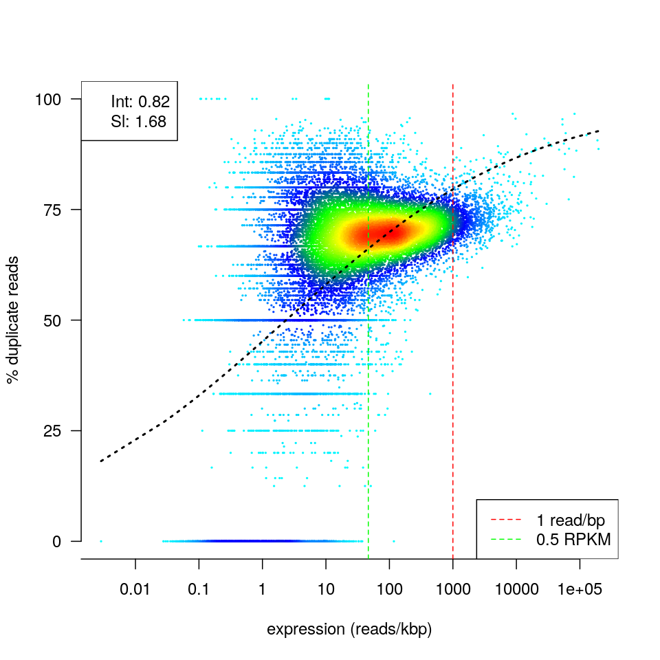
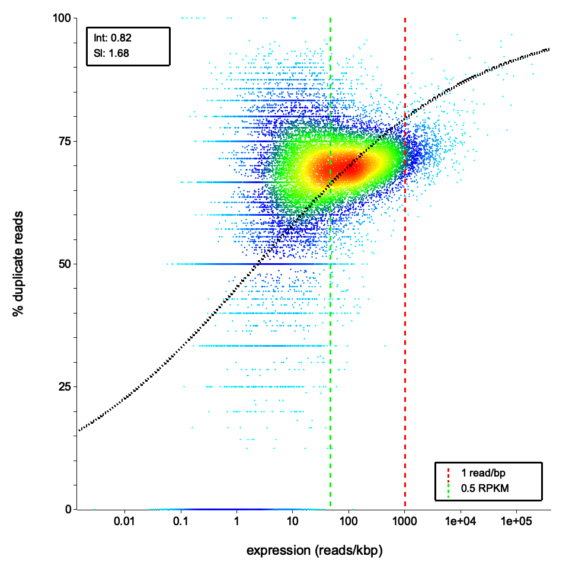
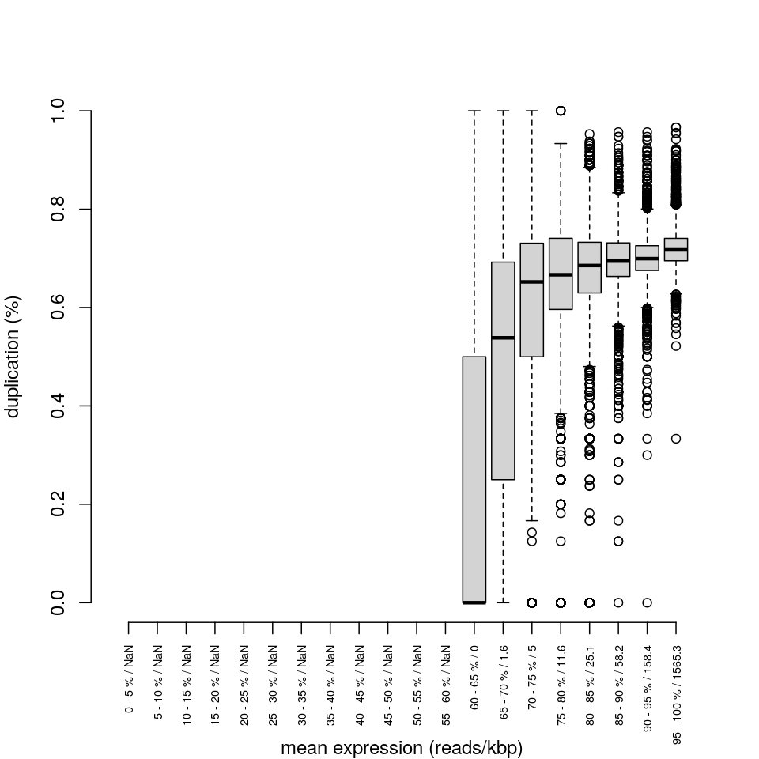
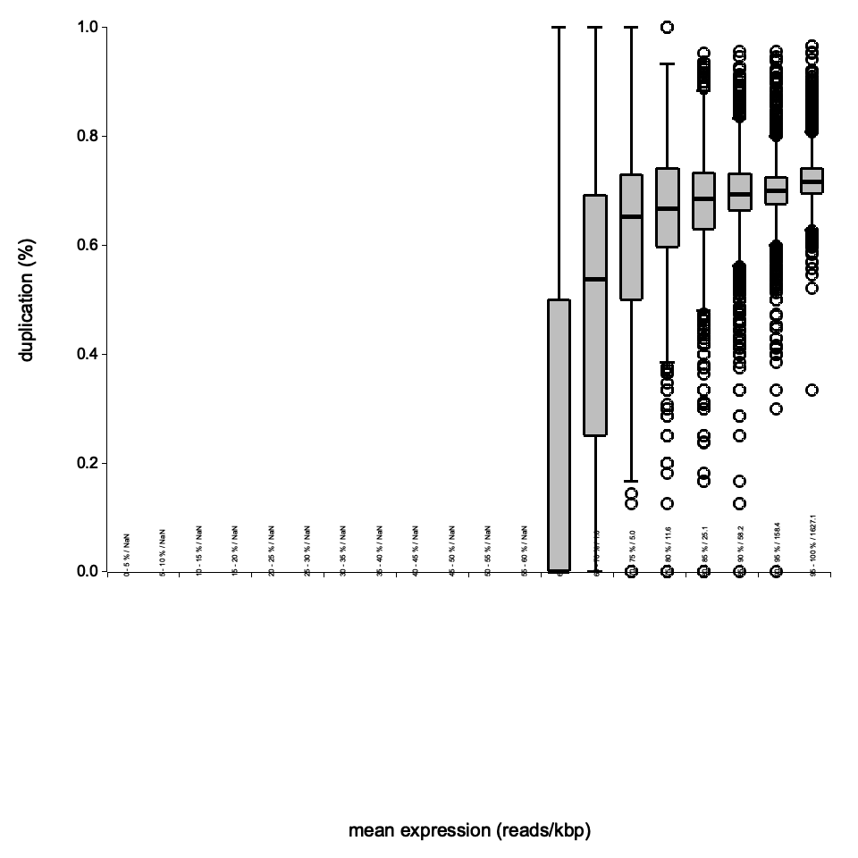
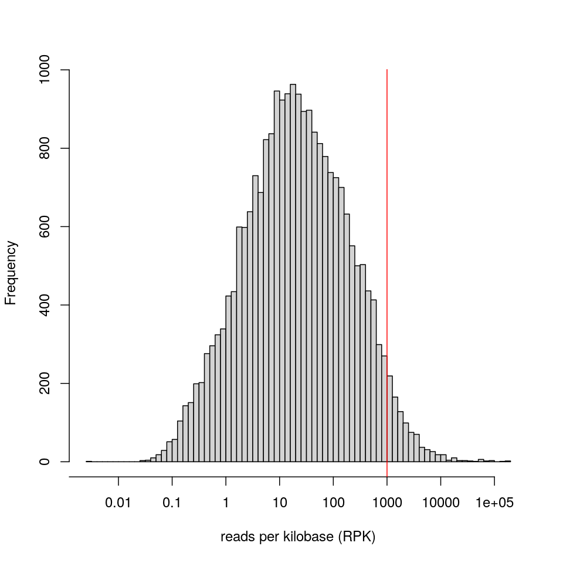
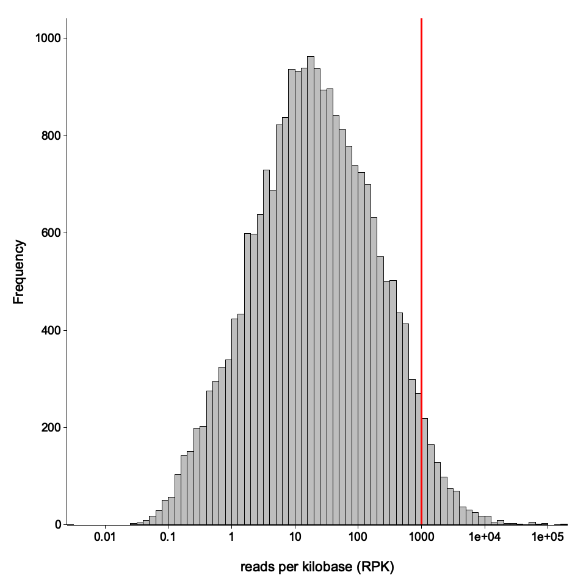

# dupRust 🧬🦀

A fast Rust reimplementation of [dupRadar](https://github.com/ssayols/dupRadar) for assessing PCR duplicate rates in RNA-Seq datasets.

dupRust analyzes duplicate-marked BAM files to compute per-gene duplication rates as a function of expression level. It produces the same outputs as the original dupRadar R/Bioconductor package, but runs significantly faster and compiles to a single static binary with no runtime dependencies.

## Comparison with dupRadar

| Feature | dupRadar (R) | dupRust |
|---------|-------------|---------|
| Language | R | Rust |
| Dependencies | R, Bioconductor, Rsubread | None (static binary) |
| BAM counting | 4 separate featureCounts calls | Single-pass BAM reading |
| Speed | Minutes per sample | Seconds per sample (~7x faster) |
| Memory | High (R overhead) | Low |
| Output format | Identical | Identical |

### Benchmarked on GM12878 REP1 (~10 GB paired-end BAM)

| Metric | dupRadar (R) | dupRust |
| --- | --- | --- |
| **Runtime** | 1,428 s | 198 s |
| **Intercept** | 0.8245 | 0.8245 |
| **Slope** | 1.6774 | 1.6774 |

Unique-mapper gene counts match **exactly** across all 63,086 genes (100%). Multi-mapper counts match 95.6%.

See the [benchmark README](benchmark/README.md) for full results and replication instructions.

### Density scatter plots

<table>
<tr><th>dupRadar (R)</th><th>dupRust</th></tr>
<tr>
<td></td>
<td></td>
</tr>
</table>

### Boxplots

<table>
<tr><th>dupRadar (R)</th><th>dupRust</th></tr>
<tr>
<td></td>
<td></td>
</tr>
</table>

### Expression histograms

<table>
<tr><th>dupRadar (R)</th><th>dupRust</th></tr>
<tr>
<td></td>
<td></td>
</tr>
</table>

## Installation

### From source

```bash
cargo build --release
```

The binary will be at `target/release/duprust`.

### Pre-built binaries

Check the [Releases](https://github.com/ewels/dupRust/releases) page for pre-built static binaries.

## Usage

```bash
duprust <BAM> <GTF> [OPTIONS]
```

### Required arguments

| Argument | Description |
|----------|-------------|
| `<BAM>` | Path to a duplicate-marked BAM file (sorted, indexed). Duplicates must be flagged (SAM flag 0x400), not removed. |
| `<GTF>` | Path to a GTF gene annotation file (e.g., from Ensembl or UCSC). |

### Options

| Option | Default | Description |
|--------|---------|-------------|
| `--stranded <0\|1\|2>` | `0` | Library strandedness: `0` = unstranded, `1` = stranded (forward), `2` = reverse-stranded |
| `--paired` | `false` | Set if the library is paired-end |
| `--threads <N>` | `1` | Number of threads for BAM reading |
| `--outdir <DIR>` | `.` | Output directory |
| `--config <FILE>` | none | Path to a YAML configuration file (see [Configuration](#configuration)) |

### Example

```bash
# Single-end, unstranded
duprust sample.markdup.bam genes.gtf --outdir results/

# Paired-end, reverse-stranded
duprust sample.markdup.bam genes.gtf --paired --stranded 2 --outdir results/

# With chromosome name mapping (e.g. Ensembl BAM + UCSC GTF)
duprust sample.markdup.bam genes.gtf --paired --config config.yaml --outdir results/
```

## Configuration

An optional YAML configuration file can be provided with `--config` to control runtime behaviour. The file is designed to be extensible — unknown fields are silently ignored, so config files remain forward-compatible.

### Chromosome name mapping

When the BAM and GTF files use different chromosome naming conventions (e.g. Ensembl `1, 2, X` vs. UCSC `chr1, chr2, chrX`), dupRust will detect the mismatch and exit with a helpful error. You can resolve this with either a prefix or explicit mapping.

**Prefix** — prepend a string to every BAM chromosome name before matching:

```yaml
chromosome_prefix: "chr"
```

**Explicit mapping** — for fine-grained control, map individual GTF names to BAM names:

```yaml
chromosome_mapping:
  chr1: "1"
  chr2: "2"
  chrX: "X"
  chrM: "MT"
```

Both options can be combined. The prefix is applied first, then explicit mappings override specific names.

### Example config file

```yaml
# Prepend "chr" to all BAM chromosome names
chromosome_prefix: "chr"

# Override the mitochondrial chromosome mapping
# (prefix would produce "chrMT", but GTF uses "chrM")
chromosome_mapping:
  chrM: "MT"
```

## Output files

For an input BAM file named `sample.bam`, the following files are generated:

| File | Description |
|------|-------------|
| `sample_dupMatrix.txt` | Tab-separated duplication matrix (14 columns, one row per gene) |
| `sample_duprateExpDens.png` | Density scatter plot of duplication rate vs. expression |
| `sample_duprateExpBoxplot.png` | Boxplot of duplication rate by expression quantile bins |
| `sample_expressionHist.png` | Histogram of gene expression levels (log10 RPK) |
| `sample_intercept_slope.txt` | Logistic regression fit parameters (intercept and slope) |
| `sample_dup_intercept_mqc.txt` | MultiQC general stats format with intercept value |
| `sample_duprateExpDensCurve_mqc.txt` | MultiQC line graph data for the fitted curve |

### Duplication matrix columns

| Column | Description |
|--------|-------------|
| `ID` | Gene identifier |
| `geneLength` | Effective gene length (non-overlapping exon bases) |
| `allCountsMulti` | Total read count (including multimappers and duplicates) |
| `filteredCountsMulti` | Read count excluding duplicates (including multimappers) |
| `dupRateMulti` | Duplication rate with multimappers |
| `dupsPerIdMulti` | Number of duplicate reads with multimappers |
| `RPKMulti` | Reads per kilobase with multimappers |
| `RPKMMulti` | RPKM with multimappers |
| `allCounts` | Total read count (unique mappers only) |
| `filteredCounts` | Read count excluding duplicates (unique mappers only) |
| `dupRate` | Duplication rate (unique mappers only) |
| `dupsPerId` | Number of duplicate reads (unique mappers only) |
| `RPK` | Reads per kilobase (unique mappers only) |
| `RPKM` | RPKM (unique mappers only) |

## How it works

1. **GTF parsing**: Reads gene annotations and computes effective gene lengths from non-overlapping exon bases.
2. **BAM counting**: Reads the BAM file once, assigning each read to a gene based on exon overlap. Four count modes are tracked simultaneously:
   - With/without multimappers x with/without duplicates
3. **Duplication matrix**: Computes RPK, RPKM, and duplication rates for each gene in all four modes.
4. **Logistic regression**: Fits a binomial GLM (`dupRate ~ log10(RPK)`) using iteratively reweighted least squares (IRLS) to model the relationship between expression and duplication.
5. **Plots**: Generates density scatter, boxplot, and histogram visualizations.
6. **MultiQC integration**: Outputs files compatible with [MultiQC](https://multiqc.info/) for pipeline reporting.

## Interpreting the results

- **Intercept** (exp(beta0)): Indicates duplication rate at low expression. Low values = good quality. High values = PCR artifact problems.
- **Slope** (exp(beta1)): Rate at which duplication increases with expression. Single-end libraries typically have higher slope than paired-end.
- **Density plot**: Good samples show low duplication (bottom of y-axis) at low expression (left), with duplication rising naturally only at very high expression.
- **1 read/bp threshold** (red dashed line): At RPK=1000, a 1kb gene has 1000 reads, meaning roughly 1 read per base pair -- near the theoretical maximum for unique reads.

## References

- Sayols S, Scherzinger D, Klein H (2016). dupRadar: a Bioconductor package for the assessment of PCR artifacts in RNA-Seq data. *BMC Bioinformatics*, 17, 428. doi:10.1186/s12859-016-1276-2
- Original R package: https://github.com/ssayols/dupRadar

## License

MIT License. See [LICENSE](LICENSE) for details.
