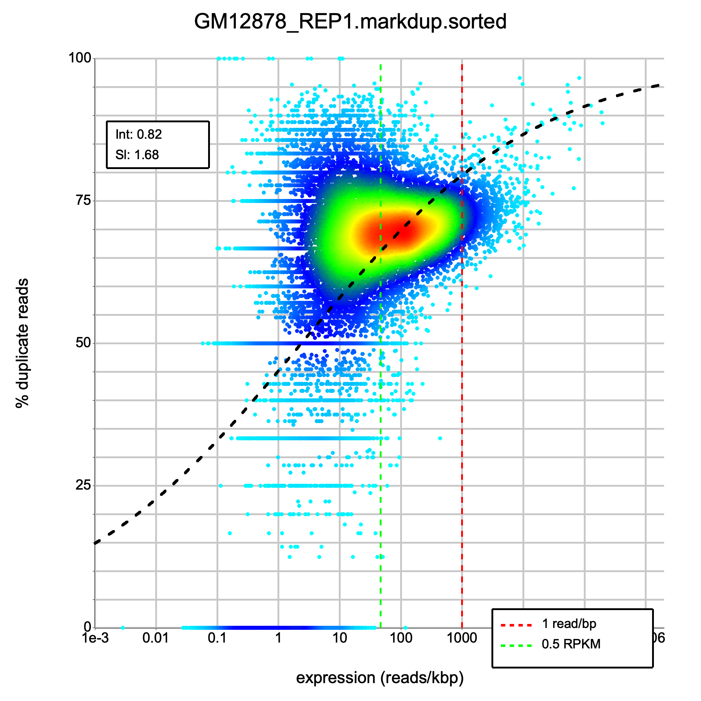
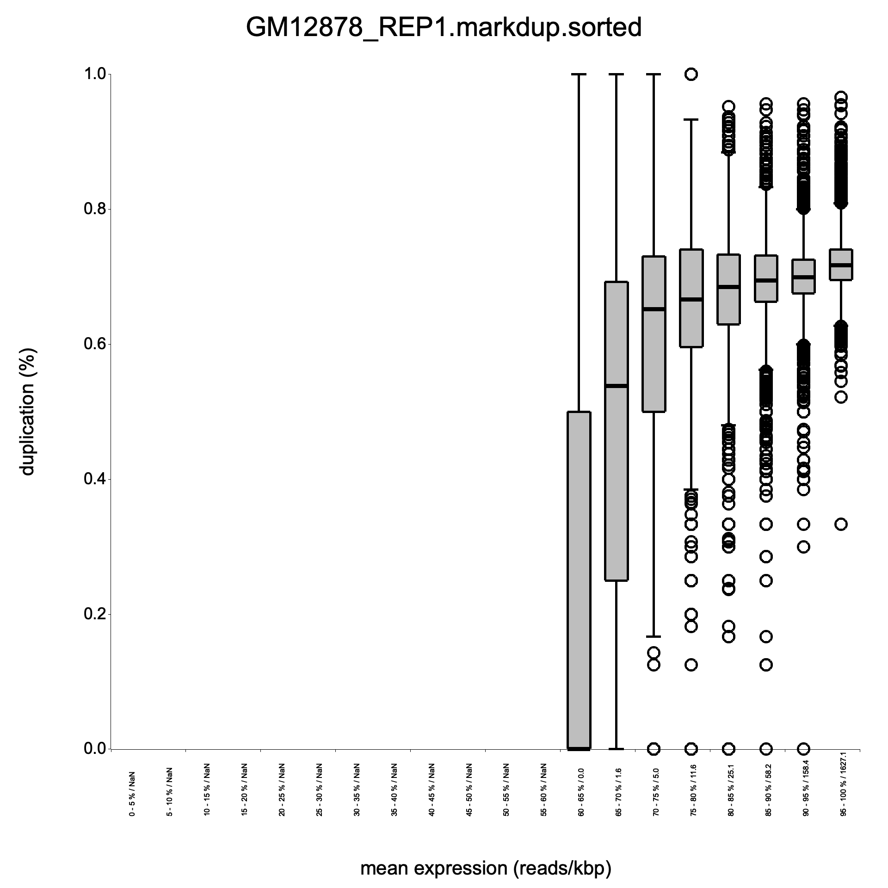
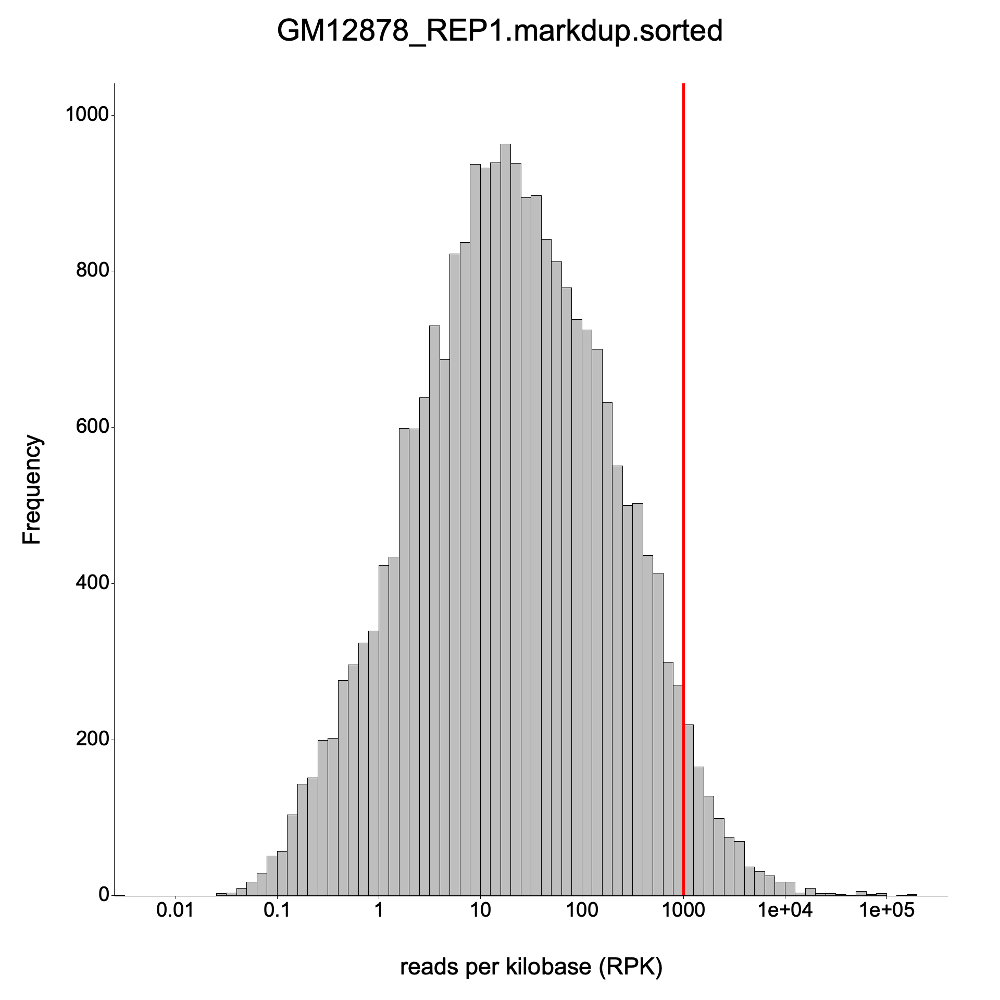

<h1 align="center">
<picture>
  <source media="(prefers-color-scheme: dark)" srcset="img/RustQC-logo-darkbg.svg">
  <source media="(prefers-color-scheme: light)" srcset="img/RustQC-logo.svg">
  
</picture>
</h1>

<h4 align="center">Fast genomics quality control tools for sequencing data, written in Rust.</h4>

---

**RustQC** is a suite of fast QC tools for sequencing data. Currently it includes the `rna` subcommand — a reimplementation of [dupRadar](https://github.com/ssayols/dupRadar) for assessing PCR duplicate rates in RNA-Seq datasets.

It analyzes duplicate-marked alignment files (SAM/BAM/CRAM) to compute per-gene duplication rates as a function of expression level. It produces the same outputs as the original **dupRadar** R/Bioconductor package, but runs significantly faster and compiles to a single static binary with no runtime dependencies.

## Comparison with dupRadar

| Feature | dupRadar (R) | RustQC |
|---------|-------------|--------|
| Language | R | Rust |
| Dependencies | R, Bioconductor, Rsubread | None (static binary) |
| Read counting | 4 separate featureCounts calls | Single-pass alignment reading |
| Speed | ~24 min for 10 GB BAM | ~1 min for 10 GB BAM (with `--threads 8`) |
| Memory | High (R overhead) | Low |
| Output format | Identical | Identical |

### Benchmarked on GM12878 REP1 (~10 GB paired-end BAM)

| Metric | dupRadar (R) | RustQC (1 thread) | RustQC (8 threads) | RustQC (10 threads) |
| --- | --- | --- | --- | --- |
| **Runtime** | 23m 48s | 3m 20s (~7x) | 1m 04s (~22x) | 0m 53s (~27x) |
| **Intercept** | 0.8245 | 0.8245 | 0.8245 | 0.8245 |
| **Slope** | 1.6774 | 1.6774 | 1.6774 | 1.6774 |

All gene counts — unique and multi-mapper — match **exactly** across all 63,086 genes (100%).

See the [benchmark README](benchmark/README.md) for full results and replication instructions.

### Density scatter plots

<table>
<tr><th>dupRadar (R)</th><th>RustQC</th></tr>
<tr>
<td></td>
<td></td>
</tr>
</table>

### Boxplots

<table>
<tr><th>dupRadar (R)</th><th>RustQC</th></tr>
<tr>
<td></td>
<td></td>
</tr>
</table>

### Expression histograms

<table>
<tr><th>dupRadar (R)</th><th>RustQC</th></tr>
<tr>
<td></td>
<td></td>
</tr>
</table>

## Installation

### Pre-built binaries

Download a pre-built binary for your platform from the [Releases](https://github.com/ewels/RustQC/releases) page:

```bash
# Linux (x86_64)
curl -fsSL https://github.com/ewels/RustQC/releases/latest/download/rustqc-linux-x86_64.tar.gz \
  | tar xz
sudo mv rustqc /usr/local/bin/

# Linux (aarch64)
curl -fsSL https://github.com/ewels/RustQC/releases/latest/download/rustqc-linux-aarch64.tar.gz \
  | tar xz
sudo mv rustqc /usr/local/bin/

# macOS (Apple Silicon)
curl -fsSL https://github.com/ewels/RustQC/releases/latest/download/rustqc-macos-aarch64.tar.gz \
  | tar xz
sudo mv rustqc /usr/local/bin/

# macOS (Intel)
curl -fsSL https://github.com/ewels/RustQC/releases/latest/download/rustqc-macos-x86_64.tar.gz \
  | tar xz
sudo mv rustqc /usr/local/bin/
```

### Docker

```bash
docker run --rm -v "$PWD":/data ghcr.io/ewels/rustqc:latest \
  rna /data/sample.markdup.bam --gtf /data/genes.gtf --outdir /data/results
```

Available tags: `latest`, or a specific version (e.g., `0.1.0`).

### From source

Requires Rust toolchain and C build dependencies (see [CONTRIBUTING.md](CONTRIBUTING.md#prerequisites)).

```bash
cargo build --release
```

The binary will be at `target/release/rustqc`.

## Usage

```bash
rustqc rna <INPUT>... --gtf <GTF> [OPTIONS]
```

### Required arguments

| Argument | Description |
|----------|-------------|
| `<INPUT>...` | One or more duplicate-marked alignment files (SAM/BAM/CRAM). Duplicates must be flagged (SAM flag 0x400), not removed. BAM/CRAM files should be sorted and indexed for parallel processing. |
| `--gtf <GTF>` | Path to a GTF gene annotation file (e.g., from Ensembl or UCSC). |

### Options

| Option | Default | Description |
|--------|---------|-------------|
| `--stranded <0\|1\|2>` | `0` | Library strandedness: `0` = unstranded, `1` = stranded (forward), `2` = reverse-stranded |
| `--paired` | `false` | Set if the library is paired-end |
| `--threads <N>` | `1` | Number of threads for parallel alignment processing |
| `--outdir <DIR>` | `.` | Output directory |
| `--reference <FASTA>` / `-r` | none | Reference FASTA file (required for CRAM input) |
| `--config <FILE>` | none | Path to a YAML configuration file (see [Configuration](#configuration)) |
| `--skip-dup-check` | `false` | Skip verification that duplicates have been marked in the BAM file (see [Duplicate marking](#duplicate-marking)) |

### Duplicate marking

RustQC requires that the input BAM file has been processed by a duplicate-marking tool such as [Picard MarkDuplicates](https://broadinstitute.github.io/picard/command-line-overview.html#MarkDuplicates), [samblaster](https://github.com/GregoryFaust/samblaster), or [sambamba markdup](https://lomereiter.github.io/sambamba/). These tools set the SAM flag `0x400` on PCR/optical duplicate reads, which RustQC uses to compute duplication rates.

Before processing, RustQC checks the BAM `@PG` header lines for known duplicate-marking programs. If none are found, it exits with an error explaining how to mark duplicates. As a secondary safeguard, if processing completes but zero duplicate-flagged reads are found among mapped reads, RustQC also exits with an error.

If you are confident that your BAM file has duplicates correctly flagged despite the header check failing, you can bypass the verification with `--skip-dup-check`.

When multiple BAM files are provided, they are processed in parallel using the available threads. The GTF is parsed once and shared across all BAM files. Threads are divided evenly among the parallel BAM jobs.

### Example

```bash
# Single BAM, single-end, unstranded
rustqc rna sample.markdup.bam --gtf genes.gtf --outdir results/

# Single BAM, paired-end, reverse-stranded
rustqc rna sample.markdup.bam --gtf genes.gtf --paired --stranded 2 --outdir results/

# CRAM input with reference FASTA
rustqc rna sample.markdup.cram --gtf genes.gtf --reference genome.fa --outdir results/

# SAM input (single-threaded only, no index)
rustqc rna sample.markdup.sam --gtf genes.gtf --outdir results/

# Multiple alignment files in parallel
rustqc rna sample1.bam sample2.bam sample3.bam --gtf genes.gtf --paired --threads 12 --outdir results/

# With chromosome name mapping (e.g. Ensembl alignment + UCSC GTF)
rustqc rna sample.markdup.bam --gtf genes.gtf --paired --config config.yaml --outdir results/
```

## Configuration

An optional YAML configuration file can be provided with `--config` to control runtime behaviour. The file is designed to be extensible — unknown fields are silently ignored, so config files remain forward-compatible.

### Chromosome name mapping

When the alignment and GTF files use different chromosome naming conventions (e.g. Ensembl `1, 2, X` vs. UCSC `chr1, chr2, chrX`), RustQC will detect the mismatch and exit with a helpful error. You can resolve this with either a prefix or explicit mapping.

**Prefix** — prepend a string to every alignment chromosome name before matching:

```yaml
chromosome_prefix: "chr"
```

**Explicit mapping** — for fine-grained control, map individual GTF names to alignment file names:

```yaml
chromosome_mapping:
  chr1: "1"
  chr2: "2"
  chrX: "X"
  chrM: "MT"
```

Both options can be combined. The prefix is applied first, then explicit mappings override specific names.

### Example config file

```yaml
# Prepend "chr" to all alignment chromosome names
chromosome_prefix: "chr"

# Override the mitochondrial chromosome mapping
# (prefix would produce "chrMT", but GTF uses "chrM")
chromosome_mapping:
  chrM: "MT"
```

## Output files

For an input file named `sample.bam` (or `sample.cram`, etc.), the following files are generated:

| File | Description |
|------|-------------|
| `sample_dupMatrix.txt` | Tab-separated duplication matrix (14 columns, one row per gene) |
| `sample_duprateExpDens.png` | Density scatter plot of duplication rate vs. expression |
| `sample_duprateExpBoxplot.png` | Boxplot of duplication rate by expression quantile bins |
| `sample_expressionHist.png` | Histogram of gene expression levels (log10 RPK) |
| `sample_intercept_slope.txt` | Logistic regression fit parameters (intercept and slope) |
| `sample_dup_intercept_mqc.txt` | MultiQC general stats format with intercept value |
| `sample_duprateExpDensCurve_mqc.txt` | MultiQC line graph data for the fitted curve |

### Duplication matrix columns

| Column | Description |
|--------|-------------|
| `ID` | Gene identifier |
| `geneLength` | Effective gene length (non-overlapping exon bases) |
| `allCountsMulti` | Total read count (including multimappers and duplicates) |
| `filteredCountsMulti` | Read count excluding duplicates (including multimappers) |
| `dupRateMulti` | Duplication rate with multimappers |
| `dupsPerIdMulti` | Number of duplicate reads with multimappers |
| `RPKMulti` | Reads per kilobase with multimappers |
| `RPKMMulti` | RPKM with multimappers |
| `allCounts` | Total read count (unique mappers only) |
| `filteredCounts` | Read count excluding duplicates (unique mappers only) |
| `dupRate` | Duplication rate (unique mappers only) |
| `dupsPerId` | Number of duplicate reads (unique mappers only) |
| `RPK` | Reads per kilobase (unique mappers only) |
| `RPKM` | RPKM (unique mappers only) |

## Performance tuning

RustQC uses multi-threaded alignment processing when `--threads` is set above 1. Within a single file, chromosomes are distributed across threads and processed in parallel, typically achieving near-linear speedup. When multiple alignment files are provided, they are also processed in parallel — the available threads are divided evenly among concurrent jobs. For a single sample, `--threads 4` is a good starting point. For multiple samples, use enough threads to keep all jobs busy (e.g., `--threads 12` for 3 files gives each 4 threads). Multi-threading requires an indexed file (`.bai`/`.csi` for BAM, `.crai` for CRAM). SAM files are always processed single-threaded.

For maximum performance when building from source, you can enable CPU-specific optimizations:

```bash
# Build with native CPU instruction set (AVX2, etc.)
RUSTFLAGS="-C target-cpu=native" cargo build --release
```

For an additional 5-20% speedup on frequently-used machines, Profile-Guided Optimization (PGO) can be used:

```bash
# Step 1: Build with profiling instrumentation
RUSTFLAGS="-Cprofile-generate=/tmp/pgo-data" cargo build --release

# Step 2: Run on representative data to collect profiles
target/release/rustqc rna sample.bam --gtf genes.gtf --paired --threads 4 -o /tmp/pgo-run

# Step 3: Merge profile data
llvm-profdata merge -o /tmp/pgo-data/merged.profdata /tmp/pgo-data

# Step 4: Rebuild with profile data
RUSTFLAGS="-Cprofile-use=/tmp/pgo-data/merged.profdata -Cllvm-args=-pgo-warn-missing-function" \
  cargo build --release
```

Note: PGO profiles are machine-specific and `target-cpu=native` produces non-portable binaries. Pre-built release binaries use generic optimizations that work on all machines.

## How it works

1. **GTF parsing**: Reads gene annotations and computes effective gene lengths from non-overlapping exon bases.
2. **Read counting**: Reads the alignment file (SAM/BAM/CRAM) once, assigning each read to a gene based on exon overlap. Four count modes are tracked simultaneously:
   - With/without multimappers x with/without duplicates
3. **Duplication matrix**: Computes RPK, RPKM, and duplication rates for each gene in all four modes.
4. **Logistic regression**: Fits a binomial GLM (`dupRate ~ log10(RPK)`) using iteratively reweighted least squares (IRLS) to model the relationship between expression and duplication.
5. **Plots**: Generates density scatter, boxplot, and histogram visualizations.
6. **MultiQC integration**: Outputs files compatible with [MultiQC](https://multiqc.info/) for pipeline reporting.

## Interpreting the results

- **Intercept** (exp(beta0)): Indicates duplication rate at low expression. Low values = good quality. High values = PCR artifact problems.
- **Slope** (exp(beta1)): Rate at which duplication increases with expression. Single-end libraries typically have higher slope than paired-end.
- **Density plot**: Good samples show low duplication (bottom of y-axis) at low expression (left), with duplication rising naturally only at very high expression.
- **1 read/bp threshold** (red dashed line): At RPK=1000, a 1kb gene has 1000 reads, meaning roughly 1 read per base pair -- near the theoretical maximum for unique reads.

## References

- Sayols S, Scherzinger D, Klein H (2016). dupRadar: a Bioconductor package for the assessment of PCR artifacts in RNA-Seq data. *BMC Bioinformatics*, 17, 428. doi:10.1186/s12859-016-1276-2
- Original R package: https://github.com/ssayols/dupRadar

## License

MIT License. See [LICENSE](LICENSE) for details.
