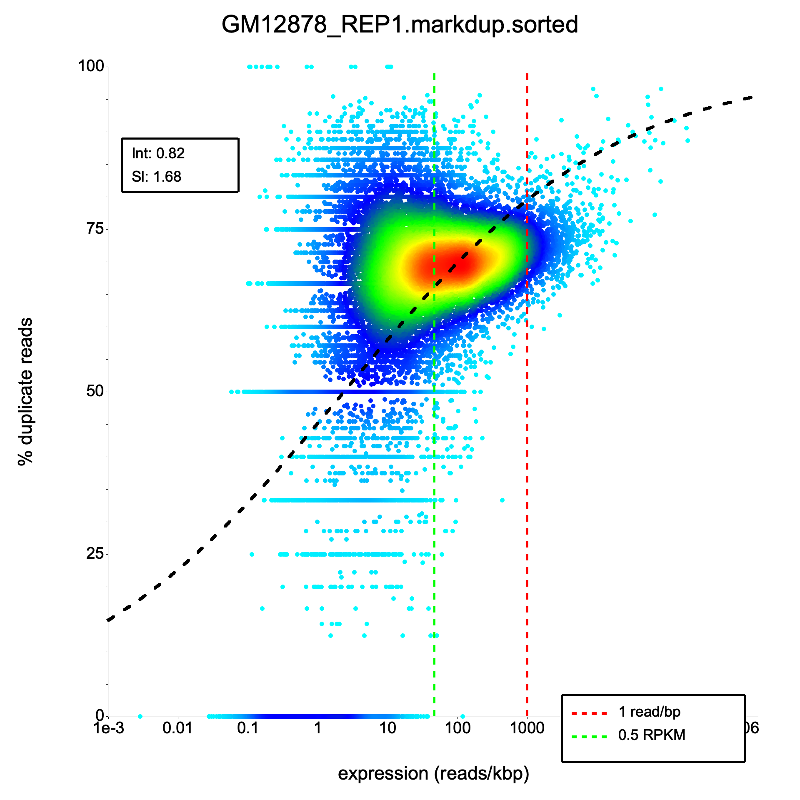

<h1 align="center">
<picture>
  <source media="(prefers-color-scheme: dark)" srcset="docs/public/RustQC-logo-darkbg.svg">
  <source media="(prefers-color-scheme: light)" srcset="docs/public/RustQC-logo.svg">
  
</picture>
</h1>

<h4 align="center">Fast genomics quality control tools for sequencing data, written in Rust.</h4>

---

**RustQC** is a growing suite of fast QC tools for sequencing data, compiled to a single static binary with no runtime dependencies. It currently includes:

- **`rustqc rna`** -- A reimplementation of [dupRadar](https://github.com/ssayols/dupRadar) for assessing PCR duplicate rates in RNA-Seq datasets, with built-in [featureCounts](http://subread.sourceforge.net/)-compatible output and biotype counting.
- **7 RSeQC reimplementations** -- Fast Rust equivalents of the most widely-used [RSeQC](https://rseqc.sourceforge.net/) Python tools: `bam-stat`, `infer-experiment`, `read-duplication`, `read-distribution`, `junction-annotation`, `junction-saturation`, and `inner-distance`.

All tools accept SAM/BAM/CRAM input and support processing multiple files in a single command.

<p align="center">
<picture>
   <source media="(prefers-color-scheme: dark)" srcset="docs/public/benchmarks/benchmark_dark.svg">
   
</picture>
</p>

<p align="center"><em>Run time for a 10 GB paired-end BAM (dupRadar + featureCounts)</em></p>

## Available tools

### `rustqc rna` -- Duplicate rate analysis + read counting

Performs dupRadar-equivalent analysis and featureCounts-compatible read counting in a single pass. Given a duplicate-marked BAM and GTF annotation, it computes per-gene duplication rates, fits a logistic regression model, generates diagnostic plots, and produces gene-level count files with biotype summaries.

| Feature | dupRadar (R) | RustQC |
|---------|-------------|--------|
| Language | R | Rust |
| Dependencies | R, Bioconductor, Rsubread | None (static binary) |
| Read counting | 4 separate featureCounts calls | Single-pass alignment reading |
| Speed | ~30 min for 10 GB BAM | <1 min for 10 GB BAM |
| Memory | High (R overhead) | Low |
| Output format | Identical | Identical |

All gene counts match **exactly** across all 63,086 genes. Cell-by-cell comparison of the full duplication matrix (820,118 values) shows **zero mismatches**. See the [benchmark documentation](https://ewels.github.io/RustQC/benchmarks/dupradar/) for detailed results.

### RSeQC tools

Reimplementations of popular [RSeQC](https://rseqc.sourceforge.net/) Python QC tools, producing output compatible with the originals:

| Subcommand | RSeQC equivalent | Description |
|------------|-----------------|-------------|
| `rustqc bam-stat` | `bam_stat.py` | Basic alignment statistics (total reads, duplicates, mapping quality, splice reads, etc.) |
| `rustqc infer-experiment` | `infer_experiment.py` | Infer library strandedness from read/gene-model overlap |
| `rustqc read-duplication` | `read_duplication.py` | Position-based and sequence-based duplication histograms |
| `rustqc read-distribution` | `read_distribution.py` | Read distribution across genomic features (CDS, UTR, intron, intergenic) |
| `rustqc junction-annotation` | `junction_annotation.py` | Classify splice junctions as known, partial novel, or complete novel |
| `rustqc junction-saturation` | `junction_saturation.py` | Saturation analysis of detected splice junctions |
| `rustqc inner-distance` | `inner_distance.py` | Inner distance distribution for paired-end reads |

All RSeQC tools require a BED12 gene model file (`-b`/`--bed`). Most accept a MAPQ cutoff (`-q`, default 30) and support multiple input files.

## Density scatter plots

<table>
<tr><th>dupRadar (R)</th><th>RustQC</th></tr>
<tr>
<td></td>
<td></td>
</tr>
</table>

### Boxplots

<table>
<tr><th>dupRadar (R)</th><th>RustQC</th></tr>
<tr>
<td></td>
<td></td>
</tr>
</table>

### Expression histograms

<table>
<tr><th>dupRadar (R)</th><th>RustQC</th></tr>
<tr>
<td></td>
<td></td>
</tr>
</table>

## Installation

### Pre-built binaries

Download a pre-built binary for your platform from the [Releases](https://github.com/ewels/RustQC/releases) page:

```bash
# Linux (x86_64)
curl -fsSL https://github.com/ewels/RustQC/releases/latest/download/rustqc-linux-x86_64.tar.gz | tar xz
chmod +x ./rustqc
sudo mv rustqc /usr/local/bin/

# Linux (aarch64)
curl -fsSL https://github.com/ewels/RustQC/releases/latest/download/rustqc-linux-aarch64.tar.gz | tar xz
chmod +x ./rustqc
sudo mv rustqc /usr/local/bin/

# macOS (Apple Silicon)
curl -fsSL https://github.com/ewels/RustQC/releases/latest/download/rustqc-macos-aarch64.tar.gz | tar xz
chmod +x ./rustqc
sudo mv rustqc /usr/local/bin/

# macOS (Intel)
curl -fsSL https://github.com/ewels/RustQC/releases/latest/download/rustqc-macos-x86_64.tar.gz | tar xz
chmod +x ./rustqc
sudo mv rustqc /usr/local/bin/
```

### Docker

```bash
docker run --rm -v "$PWD":/data ghcr.io/ewels/rustqc:latest \
  rna /data/sample.markdup.bam --gtf /data/genes.gtf --outdir /data/results
```

Available tags: `latest`, or a specific version (e.g., `0.1.0`).

### From source

Requires Rust toolchain and C build dependencies (see [CONTRIBUTING.md](CONTRIBUTING.md#prerequisites)).

```bash
cargo build --release
```

The binary will be at `target/release/rustqc`.

## Usage

### RNA duplicate rate analysis

```bash
rustqc rna <INPUT>... --gtf <GTF> [OPTIONS]
```

#### Required arguments

| Argument | Description |
|----------|-------------|
| `<INPUT>...` | One or more duplicate-marked alignment files (SAM/BAM/CRAM). Duplicates must be flagged (SAM flag 0x400), not removed. BAM/CRAM files should be sorted and indexed for parallel processing. |
| `--gtf <GTF>` | Path to a GTF gene annotation file (e.g., from Ensembl or UCSC). |

#### Options

| Option | Default | Description |
|--------|---------|-------------|
| `--stranded <0\|1\|2>` | `0` | Library strandedness: `0` = unstranded, `1` = stranded (forward), `2` = reverse-stranded |
| `--paired` | `false` | Set if the library is paired-end |
| `--threads <N>` | `1` | Number of threads for parallel alignment processing |
| `--outdir <DIR>` | `.` | Output directory |
| `--reference <FASTA>` / `-r` | none | Reference FASTA file (required for CRAM input) |
| `--config <FILE>` | none | Path to a YAML configuration file (see [Configuration](#configuration)) |
| `--biotype-attribute <NAME>` | none | Override the GTF attribute used for biotype counting (default from config: `gene_biotype`). Use `gene_type` for GENCODE GTFs. |
| `--skip-dup-check` | `false` | Skip verification that duplicates have been marked in the BAM file (see [Duplicate marking](#duplicate-marking)) |

#### Examples

```bash
# Single BAM, single-end, unstranded
rustqc rna sample.markdup.bam --gtf genes.gtf --outdir results/

# Single BAM, paired-end, reverse-stranded
rustqc rna sample.markdup.bam --gtf genes.gtf --paired --stranded 2 --outdir results/

# CRAM input with reference FASTA
rustqc rna sample.markdup.cram --gtf genes.gtf --reference genome.fa --outdir results/

# Multiple alignment files in parallel
rustqc rna sample1.bam sample2.bam sample3.bam --gtf genes.gtf --paired --threads 12 --outdir results/

# GENCODE GTF with gene_type attribute for biotypes
rustqc rna sample.markdup.bam --gtf gencode.gtf --paired --biotype-attribute gene_type --outdir results/
```

### RSeQC tools

All RSeQC tools share a common pattern: one or more input alignment files, a BED12 gene model (`-b`), and an output directory (`-o`).

```bash
# Basic alignment statistics
rustqc bam-stat sample.bam -o results/

# Infer library strandedness
rustqc infer-experiment sample.bam -b genes.bed -o results/

# Read duplication histograms (position-based and sequence-based)
rustqc read-duplication sample.bam -o results/

# Read distribution across genomic features
rustqc read-distribution sample.bam -b genes.bed -o results/

# Splice junction annotation (known / partial novel / complete novel)
rustqc junction-annotation sample.bam -b genes.bed -o results/

# Junction saturation analysis
rustqc junction-saturation sample.bam -b genes.bed -o results/

# Inner distance distribution for paired-end reads
rustqc inner-distance sample.bam -b genes.bed -o results/
```

Common options across RSeQC tools:

| Option | Default | Description |
|--------|---------|-------------|
| `-o` / `--outdir` | `.` | Output directory |
| `-q` / `--mapq` | `30` | Minimum mapping quality |
| `-r` / `--reference` | none | Reference FASTA (for CRAM) |
| `-b` / `--bed` | -- | BED12 gene model (required for most tools) |

#### Duplicate marking

RustQC's `rna` subcommand requires that the input BAM file has been processed by a duplicate-marking tool such as [Picard MarkDuplicates](https://broadinstitute.github.io/picard/command-line-overview.html#MarkDuplicates), [samblaster](https://github.com/GregoryFaust/samblaster), or [sambamba markdup](https://lomereiter.github.io/sambamba/). These tools set the SAM flag `0x400` on PCR/optical duplicate reads, which RustQC uses to compute duplication rates.

Before processing, RustQC checks the BAM `@PG` header lines for known duplicate-marking programs. If none are found, it exits with an error explaining how to mark duplicates. As a secondary safeguard, if processing completes but zero duplicate-flagged reads are found among mapped reads, RustQC also exits with an error.

If you are confident that your BAM file has duplicates correctly flagged despite the header check failing, you can bypass the verification with `--skip-dup-check`.

The RSeQC tools do not require duplicate marking.

## Configuration

An optional YAML configuration file can be provided to `rustqc rna` with `--config` to control runtime behaviour. The file is designed to be extensible -- unknown fields are silently ignored, so config files remain forward-compatible.

### Chromosome name mapping

When the alignment and GTF files use different chromosome naming conventions (e.g. Ensembl `1, 2, X` vs. UCSC `chr1, chr2, chrX`), RustQC will detect the mismatch and exit with a helpful error. You can resolve this with either a prefix or explicit mapping.

**Prefix** -- prepend a string to every alignment chromosome name before matching:

```yaml
chromosome_prefix: "chr"
```

**Explicit mapping** -- for fine-grained control, map individual GTF names to alignment file names:

```yaml
chromosome_mapping:
  chr1: "1"
  chr2: "2"
  chrX: "X"
  chrM: "MT"
```

Both options can be combined. The prefix is applied first, then explicit mappings override specific names.

### Output control

Output files are grouped by tool and can be individually enabled or disabled. All outputs are enabled by default.

```yaml
dupradar:
  dup_matrix: true
  intercept_slope: true
  density_scatter_plot: true
  boxplot: true
  expression_histogram: true
  multiqc_intercept: true
  multiqc_curve: true

featurecounts:
  counts_file: true            # featureCounts-format gene counts
  summary_file: true           # featureCounts-format assignment summary
  biotype_counts: true         # per-biotype count table
  biotype_counts_mqc: true     # MultiQC biotype bargraph
  biotype_rrna_mqc: true       # MultiQC rRNA percentage
  biotype_attribute: "gene_biotype"  # GTF attribute for biotype grouping
```

The `biotype_attribute` controls which GTF attribute is used to group genes into biotypes. Ensembl GTFs use `gene_biotype` (the default), while GENCODE GTFs use `gene_type`. This can also be overridden on the command line with `--biotype-attribute`.

If the configured biotype attribute is not found in the GTF, biotype outputs are skipped with a warning.

### Example config file

```yaml
# Prepend "chr" to all alignment chromosome names
chromosome_prefix: "chr"

# Override the mitochondrial chromosome mapping
# (prefix would produce "chrMT", but GTF uses "chrM")
chromosome_mapping:
  chrM: "MT"

# Disable dupRadar plots, keep only the matrix
dupradar:
  density_scatter_plot: false
  boxplot: false
  expression_histogram: false

# Use GENCODE biotype attribute
featurecounts:
  biotype_attribute: "gene_type"
```

## Output files

### dupRadar outputs (`rustqc rna`)

For an input file named `sample.bam`, the following files are generated. All outputs can be individually enabled or disabled via the [configuration file](#output-control).

| File | Description |
|------|-------------|
| `sample_dupMatrix.txt` | Tab-separated duplication matrix (14 columns, one row per gene) |
| `sample_duprateExpDens.{png,svg}` | Density scatter plot of duplication rate vs. expression |
| `sample_duprateExpBoxplot.{png,svg}` | Boxplot of duplication rate by expression quantile bins |
| `sample_expressionHist.{png,svg}` | Histogram of gene expression levels (log10 RPK) |
| `sample_intercept_slope.txt` | Logistic regression fit parameters (intercept and slope) |
| `sample_dup_intercept_mqc.txt` | MultiQC general stats format with intercept value |
| `sample_duprateExpDensCurve_mqc.txt` | MultiQC line graph data for the fitted curve |

### featureCounts outputs (`rustqc rna`)

| File | Description |
|------|-------------|
| `sample.featureCounts.tsv` | Gene-level read counts in featureCounts format (7 columns: Geneid, Chr, Start, End, Strand, Length, counts) |
| `sample.featureCounts.tsv.summary` | Assignment summary statistics (Assigned, Unassigned_NoFeatures, Unassigned_Ambiguity, etc.) |
| `sample.biotype_counts.tsv` | Read counts aggregated by biotype (e.g., protein_coding, lncRNA, rRNA) |
| `sample.biotype_counts_mqc.tsv` | MultiQC bargraph format for biotype counts |
| `sample.biotype_counts_rrna_mqc.tsv` | MultiQC general stats with rRNA percentage |

### RSeQC outputs

| Subcommand | Output files | Description |
|------------|-------------|-------------|
| `bam-stat` | `sample.bam_stat.txt` | Text report with alignment statistics |
| `infer-experiment` | `sample.infer_experiment.txt` | Strandedness fractions |
| `read-duplication` | `sample.pos.DupRate.xls`, `sample.seq.DupRate.xls` | Position-based and sequence-based duplication histograms |
| `read-distribution` | `sample.read_distribution.txt` | Per-region read distribution table |
| `junction-annotation` | `sample.junction.xls`, `sample.junction.bed`, `sample.junction_plot.r`, `sample.junction_annotation.txt` | Junction classifications and summary |
| `junction-saturation` | `sample.junctionSaturation_plot.r`, `sample.junctionSaturation_summary.txt` | Saturation curve data |
| `inner-distance` | `sample.inner_distance.txt`, `sample.inner_distance_freq.txt`, `sample.inner_distance_plot.r`, `sample.inner_distance_summary.txt` | Per-pair distances, histogram, and summary |

### Duplication matrix columns

| Column | Description |
|--------|-------------|
| `ID` | Gene identifier |
| `geneLength` | Effective gene length (non-overlapping exon bases) |
| `allCountsMulti` | Total read count (including multimappers and duplicates) |
| `filteredCountsMulti` | Read count excluding duplicates (including multimappers) |
| `dupRateMulti` | Duplication rate with multimappers |
| `dupsPerIdMulti` | Number of duplicate reads with multimappers |
| `RPKMulti` | Reads per kilobase with multimappers |
| `RPKMMulti` | RPKM with multimappers |
| `allCounts` | Total read count (unique mappers only) |
| `filteredCounts` | Read count excluding duplicates (unique mappers only) |
| `dupRate` | Duplication rate (unique mappers only) |
| `dupsPerId` | Number of duplicate reads (unique mappers only) |
| `RPK` | Reads per kilobase (unique mappers only) |
| `RPKM` | RPKM (unique mappers only) |

## Performance tuning

RustQC uses multi-threaded alignment processing when `--threads` is set above 1 (currently supported by `rustqc rna`). Within a single file, chromosomes are distributed across threads and processed in parallel, typically achieving near-linear speedup. When multiple alignment files are provided, they are also processed in parallel -- the available threads are divided evenly among concurrent jobs. For a single sample, `--threads 4` is a good starting point. For multiple samples, use enough threads to keep all jobs busy (e.g., `--threads 12` for 3 files gives each 4 threads). Multi-threading requires an indexed file (`.bai`/`.csi` for BAM, `.crai` for CRAM). SAM files are always processed single-threaded.

For maximum performance when building from source, you can enable CPU-specific optimizations:

```bash
# Build with native CPU instruction set (AVX2, etc.)
RUSTFLAGS="-C target-cpu=native" cargo build --release
```

For an additional 5-20% speedup on frequently-used machines, Profile-Guided Optimization (PGO) can be used:

```bash
# Step 1: Build with profiling instrumentation
RUSTFLAGS="-Cprofile-generate=/tmp/pgo-data" cargo build --release

# Step 2: Run on representative data to collect profiles
target/release/rustqc rna sample.bam --gtf genes.gtf --paired --threads 4 -o /tmp/pgo-run

# Step 3: Merge profile data
llvm-profdata merge -o /tmp/pgo-data/merged.profdata /tmp/pgo-data

# Step 4: Rebuild with profile data
RUSTFLAGS="-Cprofile-use=/tmp/pgo-data/merged.profdata -Cllvm-args=-pgo-warn-missing-function" \
  cargo build --release
```

Note: PGO profiles are machine-specific and `target-cpu=native` produces non-portable binaries. Pre-built release binaries use generic optimizations that work on all machines.

## How it works

### `rustqc rna`

1. **GTF parsing**: Reads gene annotations, computes effective gene lengths from non-overlapping exon bases, and extracts additional attributes (e.g., biotype) for downstream grouping.
2. **Read counting**: Reads the alignment file (SAM/BAM/CRAM) once, assigning each read to a gene based on exon overlap. Four count modes are tracked simultaneously:
   - With/without multimappers x with/without duplicates
   - Assignment statistics (assigned, ambiguous, no features) are tracked for the featureCounts summary.
3. **featureCounts output**: Writes gene-level counts and summary statistics in the standard featureCounts format.
4. **Biotype counting**: Aggregates assigned read counts by a configurable GTF attribute (e.g., `gene_biotype`), producing biotype count tables and MultiQC-compatible rRNA QC metrics.
5. **Duplication matrix**: Computes RPK, RPKM, and duplication rates for each gene in all four modes.
6. **Logistic regression**: Fits a binomial GLM (`dupRate ~ log10(RPK)`) using iteratively reweighted least squares (IRLS) to model the relationship between expression and duplication.
7. **Plots**: Generates density scatter, boxplot, and histogram visualizations.
8. **MultiQC integration**: Outputs files compatible with [MultiQC](https://multiqc.info/) for pipeline reporting (dupRadar intercept, fit curve, biotype bargraph, rRNA percentage).

### RSeQC tools

Each RSeQC tool is a single-pass BAM reader that processes the alignment file and produces output compatible with the original Python tools. They use a BED12 gene model for genomic feature annotation. Key implementation details:

- **bam-stat**: Flag-based read classification in a single pass (duplicates, mapping quality, splice events, proper pairs).
- **infer-experiment**: Samples reads overlapping gene intervals and determines strand protocol fractions.
- **read-duplication**: Builds position-based and sequence-based occurrence histograms.
- **read-distribution**: Classifies read tags by midpoint overlap with CDS, UTR, intron, and intergenic regions.
- **junction-annotation**: Extracts CIGAR N-operations and classifies against known splice sites from the gene model.
- **junction-saturation**: Subsamples junctions at increasing fractions to build a saturation curve.
- **inner-distance**: Computes mRNA-level or genomic inner distance between paired-end reads with transcript-aware classification.

## Interpreting the results

- **Intercept** (exp(beta0)): Indicates duplication rate at low expression. Low values = good quality. High values = PCR artifact problems.
- **Slope** (exp(beta1)): Rate at which duplication increases with expression. Single-end libraries typically have higher slope than paired-end.
- **Density plot**: Good samples show low duplication (bottom of y-axis) at low expression (left), with duplication rising naturally only at very high expression.
- **1 read/bp threshold** (red dashed line): At RPK=1000, a 1kb gene has 1000 reads, meaning roughly 1 read per base pair -- near the theoretical maximum for unique reads.

## References

- Sayols S, Scherzinger D, Klein H (2016). dupRadar: a Bioconductor package for the assessment of PCR artifacts in RNA-Seq data. *BMC Bioinformatics*, 17, 428. doi:10.1186/s12859-016-1276-2
- Original dupRadar R package: https://github.com/ssayols/dupRadar
- Wang L, Wang S, Li W (2012). RSeQC: quality control of RNA-seq experiments. *Bioinformatics*, 28(16), 2184-2185. doi:10.1093/bioinformatics/bts356
- RSeQC: https://rseqc.sourceforge.net/

## License

MIT License. See [LICENSE](LICENSE) for details.
